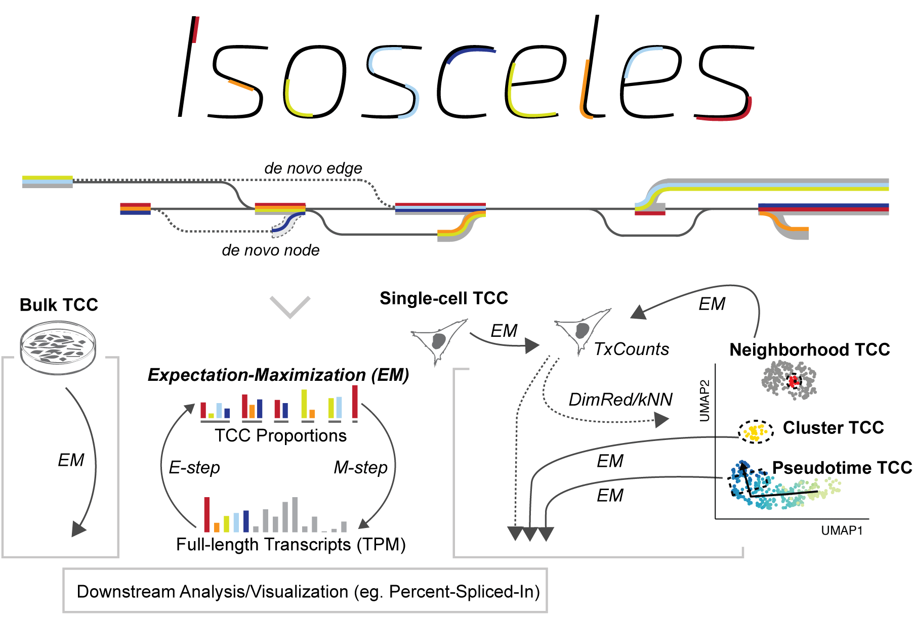

# Isosceles 

Isosceles (**Iso**forms from **S**ingle-**Ce**ll; **L**ong-read **E**xpression 
**S**uite) is an R package dedicated to transcript detection and quantification 
from long reads, supporting both bulk RNA-Seq and scRNA-Seq technologies.

<p align="center">
  
</p>

Isosceles can be installed using the following commands:
```r
install.packages(c("BiocManager", "devtools"))
BiocManager::install(c("scran", "scater", "uwot", "dittoSeq", "DEXSeq", 
                       "Nebulosa", "ggbio", "BiocStyle"))
devtools::install_github("timbitz/Isosceles", dependencies = TRUE, upgrade = TRUE)
```

Load the Isosceles package:
```r
library(Isosceles)
```

You can check if the package works correctly by running its unit tests:
```r
testthat::test_package("Isosceles")
```

In case of any problems, we recommend using the Isosceles Singularity image you
can download from [Zenodo](https://zenodo.org/record/10064997/files/isosceles.sif)
or installing the package in a
[Docker container using a Bioconductor image](https://www.bioconductor.org/help/docker).

You can follow along with our vignettes ([Introduction to the Isosceles package](https://timbitz.github.io/Isosceles/docs/Isosceles.html), [Mouse E18 brain data analysis](https://timbitz.github.io/Isosceles/docs/Mouse_E18_brain_analysis.html))
or the [reference manual](https://github.com/timbitz/Isosceles/blob/devel/docs/Isosceles.pdf)!
